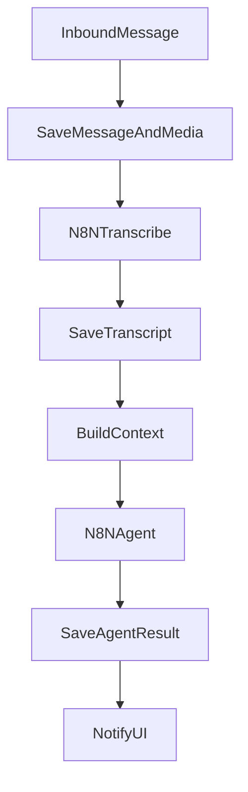

# IA Agente para Chat - Especificacoes Tecnicas

Este documento define a especificacao para um agente de IA plugavel no chat, com transcricao de audio e memoria/RAG usando Postgres + pgvector (Railway).

## Escopo e objetivos

- Transcricao de audio como primeiro passo (base universal de contexto).
- Agente plugavel em pontos do fluxo (inbound, inbox, transferencia, after-hours).
- Memoria/RAG por tenant com retencao configuravel (180 dias).
- Orquestracao via N8N para facilitar troca de modelos.

## Webhooks N8N (separados)

- `n8n_audio_webhook`: usado somente para transcricao de audio.
- `n8n_triage_webhook`: usado somente para triagem de mensagens.
- Se transcricao estiver habilitada no tenant, o webhook de audio e obrigatorio.
- Se triagem estiver habilitada no tenant, o webhook de triagem e obrigatorio.

## Banco e armazenamento

### Banco recomendado

- PostgreSQL com **pgvector** no Railway **ou** interno (proximo do N8N).
- Um unico cluster, isolamento por tenant via colunas e indices.

### Decisao de localizacao (pgvector)

- **Preferencia atual**: pgvector **interno**, na mesma rede do N8N/Whisper.
- Motivo: menor latencia, fluxo mais simples e sem exposicao externa.
- Cuidado: garantir backup, monitoramento e plano de crescimento.

### Quando usar Railway

- Se precisar de resiliencia pronta (backup/replica/monitoramento).
- Se o backend principal depende do Railway para dados criticos.

### Tabelas minimas

- `ai_memory_item`: memoria derivada de conversas.
- `ai_knowledge_document`: conhecimento de negocio por tenant.
- `ai_triage_result`: historico de execucoes do agente.
- `chat_audio_transcription`: transcricoes de audio (mensagem -> texto).

## Contrato do agente (entrada/saida)

### Entrada padrao (triagem)

- `action`: tipo de execucao (`triage`, `transfer`, `summary`, `test_prompt`).
- `tenant`: `{ id, name }`
- `conversation`: `{ id, status, contact_name, contact_phone, department, department_id }`
- `message`: `{ id, direction, content, created_at }`
- `messages`: mensagens recentes (texto ou transcricao)
- `memory_items`: memoria relevante
- `knowledge_items`: documentos relevantes
- `context`: objeto livre com dados extras (ex: horario, tags, SLA)

### Limites recomendados

- `messages`: max 20 itens
- `message.content`: max 6000 chars (truncar com reticencias)
- `messages[*].content`: max 2000 chars por item
- `context`: max 8KB serializado
- `memory_items`: max 5 itens
- `knowledge_items`: max 5 itens
- Timeout do N8N: 10s com retry exponencial (max 2)

### JSON Schema (entrada)

```
{
  "type": "object",
  "required": ["action", "tenant", "conversation", "message"],
  "properties": {
    "action": { "type": "string" },
    "tenant": { "type": "object", "required": ["id"], "properties": { "id": { "type": "string" }, "name": { "type": "string" } } },
    "conversation": { "type": "object", "required": ["id"], "properties": { "id": { "type": "string" } } },
    "message": { "type": "object", "required": ["id", "content"], "properties": { "id": { "type": "string" }, "content": { "type": "string", "maxLength": 6000 } } },
    "messages": { "type": "array" },
    "memory_items": { "type": "array" },
    "knowledge_items": { "type": "array" },
    "context": { "type": "object" }
  }
}
```

### Saida esperada

```
{
  "model": "nome-do-modelo",
  "prompt_version": "v1",
  "result": { ... },
  "memory_items": [
    { "kind": "fact", "content": "...", "metadata": { ... } }
  ],
  "actions": [
    { "type": "suggest_reply", "payload": { ... } },
    { "type": "assign_department", "payload": { "department_id": "..." } }
  ]
}
```

### JSON Schema (saida)

```
{
  "type": "object",
  "required": ["result"],
  "properties": {
    "model": { "type": "string" },
    "prompt_version": { "type": "string" },
    "result": { "type": "object" },
    "memory_items": { "type": "array" },
    "actions": { "type": "array" }
  }
}
```

### Acoes suportadas (saida.actions)

- `suggest_reply`: resposta sugerida para operador.
- `assign_department`: sugerir departamento de destino.
- `set_priority`: sugerir prioridade (`low|medium|high|urgent`).
- `add_tags`: sugerir tags para a conversa.
- `summarize`: resumo da conversa para transferencia.

## Transcricao de audio (prioridade 1)

### Decisao de integracao

- A transcricao sera feita **via N8N**, pois Whisper e N8N estao na mesma rede.
- O backend dispara o **webhook de audio** com `action: "transcribe"` e metadados.
- O Whisper nao precisa ser exposto publicamente.

### Politica de disparo (auto vs manual)

- **Automatico** quando:
  - IA/triagem habilitada no tenant.
  - Conversa ativa (atribuida a agente ou fila prioritaria).
  - Audio acima de X segundos e abaixo de Y MB.
- **Manual** (botao "Transcrever") quando:
  - IA desabilitada no tenant.
  - Conversa fora de fluxo (ex.: backlog/inbox).
  - Audio muito curto ou muito grande.

### Fluxo

1. Audio recebido/enviado chega ao chat.
2. Metadados e arquivo sao salvos.
3. Backend envia webhook para o N8N com `action: "transcribe"`.
4. N8N chama Whisper interno (mesma rede) e gera a transcricao.
5. N8N retorna o texto ao backend.
6. Transcricao salva e emitida via WebSocket.
7. A transcricao entra no contexto do agente.

### Estados

- `pending`, `processing`, `done`, `failed`

### Campos minimos

- `tenant_id`, `conversation_id`, `message_id`
- `direction`, `media_url`, `duration_ms`, `size_bytes`
- `transcript_text`, `language_detected`, `model_name`
- `processing_time_ms`, `status`, `error_message`

### Tabela `chat_audio_transcription` (proposta)

- `id` (uuid)
- `tenant_id` (uuid)
- `conversation_id` (uuid)
- `message_id` (uuid)
- `direction` (incoming/outgoing)
- `media_url` (text)
- `duration_ms` (int)
- `size_bytes` (int)
- `transcript_text` (text)
- `language_detected` (varchar)
- `model_name` (varchar)
- `processing_time_ms` (int)
- `status` (pending/processing/done/failed)
- `error_message` (text)
- `created_at` (timestamp)
- `updated_at` (timestamp)

### Payload sugerido para N8N (transcribe)

```
{
  "action": "transcribe",
  "tenant": { "id": "...", "name": "..." },
  "conversation_id": "...",
  "message_id": "...",
  "media_url": "...",
  "duration_ms": 12345,
  "size_bytes": 123456,
  "direction": "incoming"
}
```

### Resposta esperada do N8N (transcribe)

```
{
  "status": "done",
  "transcript_text": "...",
  "language_detected": "pt",
  "model_name": "whisper-small",
  "processing_time_ms": 1200
}
```

### Erros e codigos (transcribe)

- `timeout`: N8N/Whisper excedeu tempo limite.
- `media_unreachable`: arquivo nao acessivel.
- `unsupported_format`: formato nao suportado.

## Fluxo completo (alto nivel)



## Pontos de anexacao no chat

- **Inbound**: triagem imediata e classificacao.
- **Inbox**: sugestao de resposta e prioridade.
- **Transferencia**: resumo + sugestao de destino.
- **After-hours**: resposta automatica + tarefa.

## Observabilidade

- Logar latencia por execucao do agente.
- Taxa de erro por tenant e por modelo.
- Volume de transcricoes e tempo medio.
- Metricas sugeridas: `ai_agent_latency_ms`, `ai_agent_error_rate`, `transcribe_queue_depth`.

## Seguranca e privacidade

- Segredo compartilhado entre Sense e N8N.
- Assinatura HMAC em header para validar origem.
- Rate limit por tenant para evitar abuso.
- Restricao por tenant em todas as queries.
- Evitar armazenar dados sensiveis na memoria.
  - Mascarar CPFs, emails e chaves no payload.

### Assinatura HMAC (padrao)

- Header: `X-Webhook-Signature`
- Base: `HMAC_SHA256(secret, body_raw)`
- Validar antes de processar o payload.

### Mascara de dados (padrao)

- CPF: substituir por `***.***.***-**`
- Email: manter dominio, mascarar usuario (`joao@dominio.com` -> `***@dominio.com`)
- Chaves/segredos: substituir por `***`

## Checklist rapido

- [ ] Configurar pgvector no Railway
- [ ] Ativar N8N webhook e segredo
- [ ] Implementar transcricao (fila + worker + UI)
- [ ] Conectar agente no inbound/inbox/transferencia
- [ ] Validar historico e memoria por tenant

## Recomendacao de modelo (GPU P2200)

- **Escolha atual**: Llama 3.1 8B **Q4** (rodar direto).
- Motivo: cabe na VRAM de 5GB com desempenho aceitavel.
- Evitar rodar Whisper + LLM simultaneamente na mesma GPU.
- **Politica inicial**: tudo na P2200 com fila unica e prioridades.
  - Prioridade 1: Whisper (transcricao).
  - Prioridade 2: LLaVA (descricao de imagens/docs) on-demand.
  - Prioridade 3: Llama 3.1 8B (triagem/agente).
- Se a demanda crescer, adicionar segunda GPU e separar workloads.
