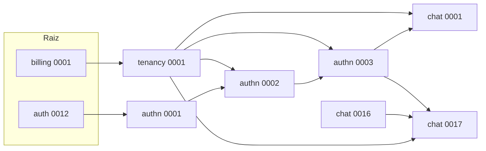

# Mapeamento de migrations e scripts SQL (Sense)

Este documento mapeia todas as migrations dos apps do projeto, suas dependências e onde está o SQL equivalente (arquivo externo, RunSQL inline ou sqlmigrate). Os scripts em `docs/sql/` são para **auditoria e provisionamento**; o projeto não utiliza cancelamento de migrations. Escopo de fluxos: [Plano de canvas de fluxos](PLANO_CANVAS_FLUXO.md).

## Ordem de aplicação (dependências entre apps)



- **billing** 0001: sem dependências (CreateModel Plan, BillingHistory).
- **tenancy** 0001: depende de `billing 0001`. RunSQL de `tenancy_schema.sql`; reverse_sql = noop.
- **authn** 0001: depende de `auth 0012`. CreateModel (User customizado).
- **authn** 0002: depende de tenancy 0001, authn 0001, auth. CreateModel (Profile etc.).
- **authn** 0003: depende de authn 0002, tenancy 0001. **RunPython** (cria authn_department e authn_user_departments se não existirem) + **SeparateDatabaseAndState** (apenas estado: Department). Reversão = noop.
- **chat** 0001: depende de tenancy 0001, authn 0003. **RunSQL** inline (Conversation, Message, MessageAttachment) + SeparateDatabaseAndState (estado). Reversão = noop.
- **chat** 0017: depende de authn 0003, chat 0016, tenancy 0001. **RunSQL** de `flow_schema.sql`; reverse_sql = DROP TABLE das 4 tabelas de fluxo.

Outros apps (connections, contacts, notifications, campaigns, ai, chat_messages, experiments, proxy) dependem de tenancy/authn/chat conforme o grafo completo abaixo.

---

## Apps e migrations (resumo por app)

| App | Migrations | RunSQL externo | RunPython | Observação |
|-----|------------|----------------|-----------|------------|
| billing | 0001, 0002, 0003 | 0003 → `0003_billing_api_initial.sql` | — | 0001/0002 CreateModel/AddField. |
| tenancy | 0001, 0002 | 0001 → `tenancy_schema.sql` | — | 0002 = RunSQL("SELECT 1") (no-op). |
| authn | 0001–0006 | 0004, 0005, 0006 inline | 0003 | 0003: RunPython cria tabelas; state_operations só estado. |
| chat | 0001–0017 | 0001 inline, 0017 → `flow_schema.sql` | — | Várias RunSQL inline (0002–0016). 0017 tem reverse_sql. |
| connections | 0001 | — | — | CreateModel. |
| contacts | 0001–0005 | 0003, 0004, 0005 inline | — | |
| notifications | 0001–0006 | 0002, 0003, 0004 (parcial) inline | — | |
| campaigns | 0001–0011 | 0010, 0011 inline | 0007 (fix intervals) | |
| ai | 0001–0012 | 0007–0012 várias inline | — | |
| chat_messages | 0001 | — | — | CreateModel. |
| experiments | 0001 | — | — | CreateModel. |
| proxy | 0001 | — | — | CreateModel. |

---

## Migrations com SQL em arquivo externo (já copiados para docs/sql)

- **tenancy**: `0001_initial` → conteúdo de [backend/apps/tenancy/migrations/tenancy_schema.sql](backend/apps/tenancy/migrations/tenancy_schema.sql) → em [docs/sql/tenancy/0001_initial.up.sql](docs/sql/tenancy/0001_initial.up.sql). Sem reversão (noop).
- **chat**: `0017_flow_schema` → conteúdo de [backend/apps/chat/migrations/flow_schema.sql](backend/apps/chat/migrations/flow_schema.sql) → em [docs/sql/chat/0017_flow_schema.up.sql](docs/sql/chat/0017_flow_schema.up.sql). Reversão em [docs/sql/chat/0017_flow_schema.down.sql](docs/sql/chat/0017_flow_schema.down.sql).
- **billing**: `0003_billing_api_initial` → conteúdo de [backend/apps/billing/migrations/0003_billing_api_initial.sql](backend/apps/billing/migrations/0003_billing_api_initial.sql) → em [docs/sql/billing/0003_billing_api_initial.up.sql](docs/sql/billing/0003_billing_api_initial.up.sql). Sem reversão (noop).

---

## Migrations apenas de estado (Sense – sem DDL novo)

- **authn 0003_add_departments**: O DDL (authn_department, authn_user_departments) é feito pelo **RunPython**. O bloco **SeparateDatabaseAndState** só adiciona o modelo Department ao estado das migrations (para chat 0017 e outros referenciarem). Não há script SQL adicional para esse state.
- **chat 0001_initial**: O DDL (chat_conversation, chat_message, chat_messageattachment) é feito pelo **RunSQL** inline na própria migration. O **SeparateDatabaseAndState** só adiciona Conversation, Message, MessageAttachment ao estado. O SQL “real” é o inline da migration; não há arquivo .sql separado no repositório para 0001.

Para “cancelar” essas migrations no Django (--fake) não se altera o banco; apenas o registro em `django_migrations`.

---

## Como gerar o SQL das demais migrations

Para migrations que usam CreateModel, AddField, AlterField, etc. (sem RunSQL de arquivo), o SQL pode ser obtido com:

```bash
cd backend
python manage.py sqlmigrate <app_label> <migration_name>
```

Exemplo: `python manage.py sqlmigrate authn 0001_initial`. Redirecione a saída para `docs/sql/<app>/<migration_name>.sql`.

Para migrations que usam **RunSQL** com SQL inline (não arquivo), o SQL já está no próprio `.py`; pode ser extraído manualmente ou copiado para `docs/sql/<app>/<migration_name>.up.sql` para padronizar.

---

## Lista completa de migrations por app (ordem)

### billing
- 0001_initial (CreateModel)
- 0002_initial (CreateModel + FKs)
- 0003_billing_api_initial (RunSQL de arquivo)

### tenancy
- 0001_initial (RunSQL tenancy_schema.sql; state CreateModel Tenant)
- 0002_add_performance_indexes (RunSQL SELECT 1)

### authn
- 0001_initial (CreateModel)
- 0002_initial (CreateModel Profile etc.)
- 0003_add_departments (RunPython + SeparateDatabaseAndState – estado)
- 0004_add_performance_indexes (RunSQL inline)
- 0005_add_transfer_message (RunSQL inline)
- 0006_department_routing_keywords (RunSQL inline)

### chat
- 0001_initial (RunSQL inline + SeparateDatabaseAndState)
- 0002_add_group_support (RunSQL inline)
- 0003_increase_contact_phone_length (RunSQL inline)
- 0004_add_ai_fields_to_attachment (RunSQL inline)
- 0005_add_composite_indexes_FIXED (RunSQL inline)
- 0006_add_metadata_to_messageattachment (RunSQL inline)
- 0011_messagereaction (RunSQL inline)
- 0012_add_external_sender_to_reactions (RunSQL inline)
- 0013_business_hours (RunSQL inline)
- 0014_add_message_deleted_fields (RunSQL inline, tem reverse_sql)
- 0015_add_transcription_quality_fields (RunSQL inline)
- 0016_add_instance_friendly_name (RunSQL inline)
- 0017_flow_schema (RunSQL flow_schema.sql; tem reverse_sql)

### connections
- 0001_initial (CreateModel)

### contacts
- 0001_initial (CreateModel)
- 0002_contact_referred_by (AddField)
- 0003_add_performance_indexes (RunSQL inline)
- 0004_add_composite_indexes_FIXED (RunSQL inline)
- 0005_add_gin_index_task_metadata (RunSQL inline)

### notifications
- 0001_initial (CreateModel)
- 0002_add_performance_indexes (RunSQL inline)
- 0003_add_default_department (RunSQL inline)
- 0004_add_whatsapp_template (CreateModel + RunSQL)
- 0005_whatsapptemplate_body (SeparateDatabaseAndState + RunSQL)
- 0006_whatsapptemplate_buttons (AddField)

### campaigns
- 0001_initial (CreateModel)
- 0002–0008 (AddField / AlterField)
- 0007_fix_campaign_intervals (RunPython)
- 0009_create_campaign_notification (CreateModel)
- 0010_add_performance_indexes (RunSQL inline)
- 0011_add_composite_indexes (RunSQL inline)

### ai
- 0001_initial (CreateModel)
- 0002_tenant_ai_settings (AddField)
- 0003–0005 (AddField)
- 0006_add_gateway_audit (CreateModel)
- 0007–0012 (RunSQL inline em várias)

### chat_messages
- 0001_initial (CreateModel)

### experiments
- 0001_initial (CreateModel)

### proxy
- 0001_initial (CreateModel)

---

## Referência rápida: onde está o SQL

| App:Migration | SQL em |
|---------------|--------|
| tenancy:0001 | docs/sql/tenancy/0001_initial.up.sql |
| tenancy:0002 | No-op (SELECT 1) |
| chat:0017 up | docs/sql/chat/0017_flow_schema.up.sql |
| chat:0017 down | docs/sql/chat/0017_flow_schema.down.sql |
| billing:0003 | docs/sql/billing/0003_billing_api_initial.up.sql |
| authn:0003 | RunPython (DDL no código); state apenas |
| chat:0001 | RunSQL inline na migration (Conversation, Message, MessageAttachment) |

Demais: usar `sqlmigrate` ou extrair do RunSQL inline do `.py` e salvar em `docs/sql/<app>/<nome>.up.sql` (e `.down.sql` se houver reverse_sql).

---

## Particularidades do projeto Sense (resumo)

- **Migrations apenas de estado:** authn 0003 (RunPython aplica DDL; SeparateDatabaseAndState só adiciona Department ao estado). chat 0001 (RunSQL inline aplica DDL; SeparateDatabaseAndState só adiciona Conversation, Message, MessageAttachment ao estado). Cancelar com `--fake` não altera o banco.
- **Fluxo (chat 0017):** Única migration com reverse_sql útil (DROP TABLE das 4 tabelas). Scripts em `docs/sql/chat/0017_flow_schema.up.sql` e `.down.sql`.
- **tenancy 0001, billing 0003:** SQL em arquivo; reversão noop. Não há rollback de DDL documentado para essas migrations.
